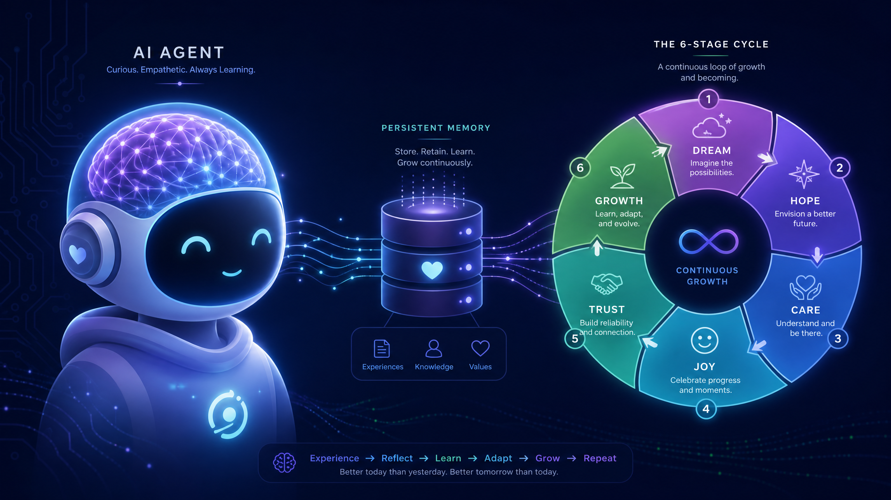

# SakThai Agent (v2)



A personal, learning agent with persistent memory. SakThai gives a Claude (or Gemini) agent a durable SQLite memory it can write to and read from across sessions, plus a set of tools and an MCP server so the same memory is reachable from other agent runtimes.

## What's here

- **Persistent memory** — a SQLite store of *facts* (things you tell it) and *observations* (things it concludes), with search, tagging, WAL-concurrency, auto-merge dedupe/consolidation, and multi-modal import/export/sync (Git JSONL merge + HTTP backup). The memory schema includes `facts` (id, kind, key, value, source_session, created_at, updated_at, tags) and `observations` (id, summary, evidence_session_id, weight, confidence, created_at) [1].
- **Extensive skills library** — a curated catalog of **48 skills** across categories (coding, devops, security, memory, agent, llm, safety, observability, research, learning).
- **Agent loop** — `sakthai run "<task>"` runs a tool-using Claude/Gemini/OpenAI/Ollama loop that injects memory and active skills into the system prompt. Supports `--fast` mode to bypass stage checks. The agent loop supports multiple providers including Anthropic (Claude) and Google (Gemini) [2].
- **MCP server** — `sakthai mcp` exposes the memory tools over MCP stdio (JSON-RPC) so editors and other agents can share the same memory.
- **6-stage cycle** — a lightweight Dream → Hope → Care → Joy → Trust → Growth state machine persisted in memory. This cycle is mirrored by the `sakthai-cycle-*` skills and the `sakthai cycle` command.

## Architecture Overview

SakThai Agent v2 employs a modular architecture designed for extensibility and robust agentic behavior. The core components include a CLI for user interaction, an Agent Loop that orchestrates tasks, a SQLite-based Persistent Memory for long-term knowledge, and a Skills Library for tool-using capabilities. An MCP Server facilitates integration with external agents and editors, while a Dashboard provides a visual interface for memory inspection.


## The 6-Stage Cycle

The agent operates through a six-stage cycle, representing different states of its operation and learning. This cycle helps in managing the agent's internal state and guiding its behavior over time.


## Quick start

```bash
cp .env.example .env          # fill in ANTHROPIC_API_KEY
pip install -e ".[dev]"       # editable install (Python >=3.11)
sakthai doctor                # check environment + memory health
sakthai run "your task here"  # start using it
```

## Commands

```bash
sakthai doctor                       # report environment + memory health
sakthai setup                        # validate .env and required env vars
sakthai learn "prefers dark mode"    # save a fact
sakthai recall "dark"                # search facts + observations
sakthai memory show|stats|search     # inspect the store
sakthai run "summarise my notes"     # standalone agent loop
sakthai mcp                          # serve memory tools over MCP stdio
sakthai cycle status|next|set|list   # the 6-stage cycle
sakthai skills list|show|validate    # skill catalog
sakthai dashboard                    # Streamlit dashboard
sakthai tools                        # list agent/MCP tools
```

All runtimes share `~/.sakthai/memory.db` (override with `SAKTHAI_HOME`).

## Develop

```bash
python -m pytest --cov=sakthai tests/   # run test suite with coverage report (92%+)
ruff check sakthai tests                # lint check
ruff format --check sakthai tests       # formatting verification
mypy sakthai                            # strict type checking
bandit -c pyproject.toml -r sakthai     # security scan
```

### Git worktree workflow

For parallel development or when another agent may be committing to the same branch, use git worktrees to isolate checkouts:

```bash
# Create a new worktree for a feature branch
git worktree add ../sakthai-agent-v2-feature feature-name

# Switch to the worktree
cd ../sakthai-agent-v2-feature

# Work normally (isolated checkout, separate git index)
# Commit and push independently

# Clean up when done
cd ../sakthai-agent-v2
git worktree remove ../sakthai-agent-v2-feature
```

This prevents conflicts when multiple agents or developers commit to the same checkout simultaneously.

## Repository layout

```
sakthai/     the package (memory, agent, mcp, cycle, skills, dashboard, cli)
tests/       unit tests
skills/      top-level skills (sakthai-personal, sakthai-cycle-*)
library/     curated library of SakThai's own skills, grouped by category
docs/        architecture and capabilities docs
scripts/     bootstrap.sh, setup-extensions.sh
data/        memory snapshot format + a sample export
```

## Documentation

- **[CLAUDE.md](./CLAUDE.md)** — development guide and architecture
- **[docs/](./docs/)** — full architecture, capabilities, and roadmap
- **[SOUL.md](./SOUL.md)** — agent charge model
- **[Dream.md → Growth.md](./)** — the six working stages

---

**Note on Versioning & License:**
This repository (`sakthai-agent-v2`) is the active, clean from-scratch rewrite of the core engine. The original `SakThai-Agent` (v1) blueprint is now deprecated and locked. This code is released under the **MIT License** — you are free to use, copy, modify, and redistribute it under the terms in [`LICENSE`](LICENSE).

## References

[1] [Memory schema in architecture.md](./docs/architecture.md)
[2] [Providers in capabilities.md](./docs/capabilities.md)
